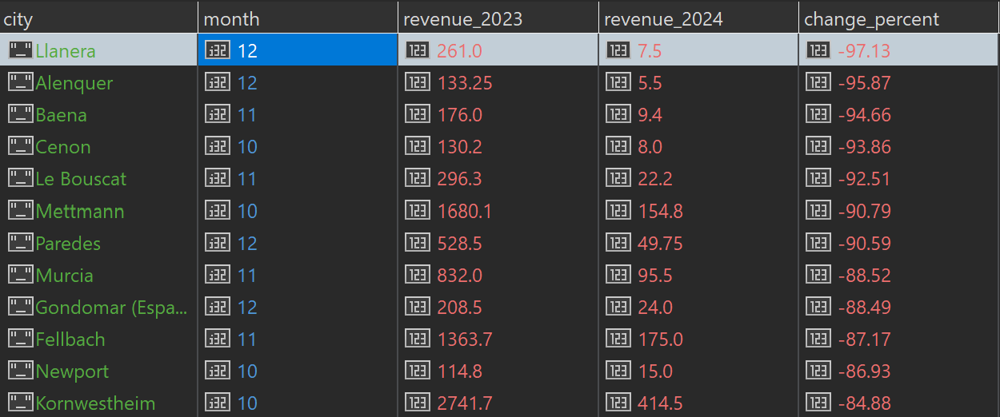
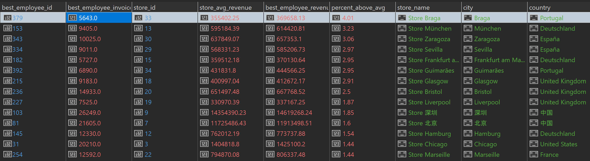

### Upiti - Menadzer prodaje

### Upit 1: Prodavnice rangirane po prosečnoj vrednosti fakture, sa poređenjem sa globalnim prosekom. Koje prodavnice su iznad/ispod globalnog proseka prosečne fakture, i za koliko?

```javascript
db.getCollection("invoices").aggregate([
  {
    $group: {
      _id: "$store_id",
      avg_invoice: { $avg: "$invoice_total" }
    }
  },
  {
    $sort: { avg_invoice: -1 }
  },
  {
    $group: {
      _id: null,
      stores: { $push: { store_id: "$_id", avg_invoice: "$avg_invoice" } },
      global_avg: { $avg: "$avg_invoice" }
    }
  },
  {
    $unwind: "$stores"
  },
  {
    $project: {
      _id: 0,
      store_id: "$stores.store_id",
      avg_invoice: "$stores.avg_invoice",
      global_avg: 1,
      difference: { $subtract: ["$stores.avg_invoice", "$global_avg"] },
      status: {
        $cond: {
          if: { $gte: ["$stores.avg_invoice", "$global_avg"] },
          then: "above average",
          else: "below average"
        }
      }
    }
  },
  {
    $lookup: {
      from: "stores",
      localField: "store_id",
      foreignField: "_id",
      as: "store_info"
    }
  },
  {
    $project: {
      store_id: 1,
      store_name: { $arrayElemAt: ["$store_info.store_name", 0] },
      city: { $arrayElemAt: ["$store_info.city", 0] },
      country: { $arrayElemAt: ["$store_info.country", 0] },
      avg_invoice: 1,
      global_avg: 1,
      difference: 1,
      status: 1
    }
  },
  {
    $sort: { avg_invoice: -1 }
  }
])
```

**Rezultat upita:**


*Prosecno vreme izvrsavanja: 4.29s*  


### Upit 2: Top 10% kupaca po potrošnji sa dominantnim načinom plaćanja. Identifikovati top 10% kupaca koji najviše troše i utvrditi koji način plaćanja dominira kod njih.

```javascript
db.getCollection("invoices").aggregate([
  {
    $group: {
      _id: {
        customer_id: "$customer.customer_id",
        payment_method: "$payment_method"
      },
      total_spent: { $sum: "$invoice_total" },
      customer_name: { $first: "$customer.name" },
      customer_city: { $first: "$customer.city" },
      customer_country: { $first: "$customer.country" }
    }
  },
  {
    $sort: { total_spent: -1 }
  },
  {
    $group: {
      _id: "$_id.customer_id",
      customer_name: { $first: "$customer_name" },
      customer_city: { $first: "$customer_city" },
      customer_country: { $first: "$customer_country" },
      dominant_payment: { $first: "$_id.payment_method" },
      total_spent: { $sum: "$total_spent" }
    }
  },
  {
    $sort: { total_spent: -1 }
  },
  {
    $limit: 128370
  },
  {
    $project: {
      _id: 0,
      customer_id: "$_id",
      customer_name: 1,
      customer_city: 1,
      customer_country: 1,
      dominant_payment: 1,
      total_spent: { $round: ["$total_spent", 2] }
    }
  }
])
```

**Rezultat upita:**


*Prosecno vreme izvrsavanja: 62.33s*  

### Upit 3: Identifikovati koje prodavnice imaju najviše problema sa vraćanjem robe i koja kategorija dominira u povraćajima.

```javascript
db.getCollection("invoices").aggregate([
  {
    $match: {
      transaction_type: "Return"
    }
  },
  {
    $unwind: "$lines"
  },
  {
    $group: {
      _id: {
        store_id: "$store_id",
        category: "$lines.category"
      },
      total_returns: { $sum: "$lines.quantity" },
      total_return_value: { $sum: "$lines.line_total" }
    }
  },
  {
    $sort: {
      "_id.store_id": 1,
      total_returns: -1
    }
  },
  {
    $group: {
      _id: "$_id.store_id",
      top_category: { $first: "$_id.category" },
      top_category_returns: { $first: "$total_returns" },
      top_category_value: { $first: "$total_return_value" }
    }
  },
  {
    $lookup: {
      from: "stores",
      localField: "_id",
      foreignField: "_id",
      as: "store_info"
    }
  },
  {
    $project: {
      _id: 0,
      store_id: "$_id",
      store_name: { $arrayElemAt: ["$store_info.store_name", 0] },
      city: { $arrayElemAt: ["$store_info.city", 0] },
      country: { $arrayElemAt: ["$store_info.country", 0] },
      top_category: 1,
      top_category_returns: 1,
      top_category_value: { $round: ["$top_category_value", 2] }
    }
  },
  {
    $sort: { top_category_returns: -1 }
  }
])
```

**Rezultat upita:**
 

*Prosecno vreme izvrsavanja: 4.36s*  

### Upit 4: Prikazati koji gradovi pokazuju pad prihoda u Q4 (oktobar, novembar, decembar) u 2024. godini u odnosu na isti period 2023.

```javascript
db.getCollection("invoices").aggregate([
  {
    $match: {
      transaction_type: "Sale",
      $expr: {
        $in: [
          { $month: { $dateFromString: { dateString: "$date" } } },
          [10, 11, 12]
        ]
      }
    }
  },
  {
    $group: {
      _id: {
        city: "$customer.city",
        year: { $year: { $dateFromString: { dateString: "$date" } } },
        month: { $month: { $dateFromString: { dateString: "$date" } } }
      },
      monthly_revenue: { $sum: "$invoice_total" }
    }
  },
  {
    $group: {
      _id: {
        city: "$_id.city",
        month: "$_id.month"
      },
      yearly_data: {
        $push: {
          year: "$_id.year",
          revenue: "$monthly_revenue"
        }
      }
    }
  },
  {
    $project: {
      _id: 0,
      city: "$_id.city",
      month: "$_id.month",
      revenue_2023: {
        $sum: {
          $map: {
            input: { $filter: { input: "$yearly_data", as: "d", cond: { $eq: ["$$d.year", 2023] } } },
            as: "d",
            in: "$$d.revenue"
          }
        }
      },
      revenue_2024: {
        $sum: {
          $map: {
            input: { $filter: { input: "$yearly_data", as: "d", cond: { $eq: ["$$d.year", 2024] } } },
            as: "d",
            in: "$$d.revenue"
          }
        }
      }
    }
  },
  {
    $match: {
      revenue_2023: { $gt: 0 },
      revenue_2024: { $gt: 0 }
    }
  },
  {
    $project: {
      city: 1,
      month: 1,
      revenue_2023: { $round: ["$revenue_2023", 2] },
      revenue_2024: { $round: ["$revenue_2024", 2] },
      change_percent: {
        $round: [
          {
            $multiply: [
              { $divide: [{ $subtract: ["$revenue_2024", "$revenue_2023"] }, "$revenue_2023"] },
              100
            ]
          },
          2
        ]
      }
    }
  },
  {
    $match: {
      change_percent: { $lt: 0 }
    }
  },
  {
    $sort: { change_percent: 1 }
  }
])
```

**Rezultat upita:**
 

*Prosecno vreme izvrsavanja: 14.04s*  

### Upit 5: Pronaći najboljeg radnika u svakoj prodavnici, koliko je zaradio i za koliko procenata je bolji od proseka prodavnice.

```javascript
db.getCollection("invoices").aggregate([
  {
    $match: {
      transaction_type: "Sale"
    }
  },
  {
    $group: {
      _id: {
        employee_id: "$employee_id",
        store_id: "$store_id"
      },
      total_revenue: { $sum: "$invoice_total" },
      total_invoices: { $sum: 1 }
    }
  },
  {
    $group: {
      _id: "$_id.store_id",
      store_avg_revenue: { $avg: "$total_revenue" },
      best_employee_id: { $first: "$_id.employee_id" },
      best_employee_revenue: { $max: "$total_revenue" },
      best_employee_invoices: { $first: "$total_invoices" }
    }
  },
  {
    $project: {
      _id: 0,
      store_id: "$_id",
      store_avg_revenue: { $round: ["$store_avg_revenue", 2] },
      best_employee_id: 1,
      best_employee_revenue: { $round: ["$best_employee_revenue", 2] },
      best_employee_invoices: 1,
      percent_above_avg: {
        $round: [
          {
            $multiply: [
              {
                $divide: [
                  { $subtract: ["$best_employee_revenue", "$store_avg_revenue"] },
                  "$store_avg_revenue"
                ]
              },
              100
            ]
          },
          2
        ]
      }
    }
  },
  {
    $lookup: {
      from: "stores",
      localField: "store_id",
      foreignField: "_id",
      as: "store_info"
    }
  },
  {
    $project: {
      store_id: 1,
      store_name: { $arrayElemAt: ["$store_info.store_name", 0] },
      city: { $arrayElemAt: ["$store_info.city", 0] },
      country: { $arrayElemAt: ["$store_info.country", 0] },
      best_employee_id: 1,
      best_employee_revenue: 1,
      best_employee_invoices: 1,
      store_avg_revenue: 1,
      percent_above_avg: 1
    }
  },
  {
    $sort: { percent_above_avg: -1 }
  }
])
```

**Rezultat upita:**
 

*Prosecno vreme izvrsavanja: 5.61s*  
