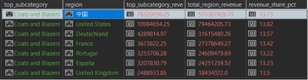
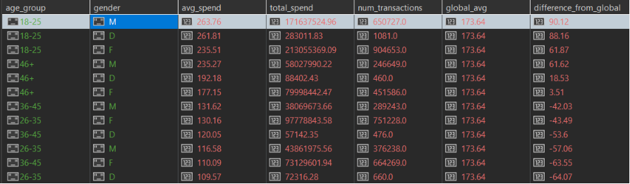
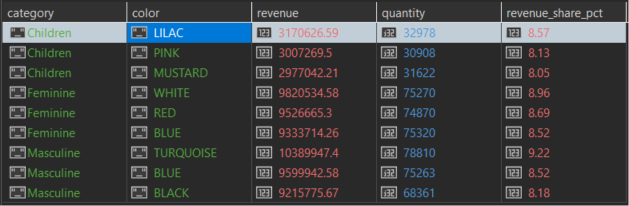
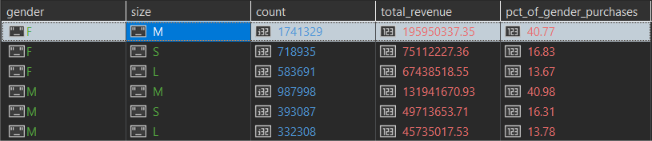
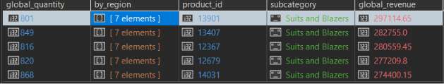

# UPITI 
# Marketing Analyst

### UPIT 1: za svaku zemlju, izlistati subkategoriju proizvoda koja je donela najveci ukupni prihod i koliki je njen udeo u ukupnom prihodu te zemlje

```javascript
db.invoice_lines_denorm.aggregate(
    [
        {
            $group: {
                _id: {
                    region: "$store_country",
                    subcategory: "$subcategory"
                },
                subcategory_revenue: { $sum: "$line_total" }
            }
        },
        {
            $sort: {
                "_id.region": 1,
                subcategory_revenue: -1
            }
        },
        {
            $group: {
                _id: "$_id.region",
                top_subcategory: { $first: "$_id.subcategory" },
                top_subcategory_revenue: { $first: "$subcategory_revenue" },
                total_region_revenue: { $sum: "$subcategory_revenue" }
            }
        },
        {
            $project: {
                _id: 0,
                region: "$_id",
                top_subcategory: 1,
                top_subcategory_revenue: { $round: ["$top_subcategory_revenue", 2] },
                total_region_revenue: { $round: ["$total_region_revenue", 2] },
                revenue_share_pct: {
                    $round: [
                        { $multiply: [{ $divide: ["$top_subcategory_revenue", "$total_region_revenue"] }, 100] },
                        2
                    ]
                }
            }
        },
        { $sort: { total_region_revenue: -1 } }
    ],
    { allowDiskUse: true }
)
```

### Rezultat upita:




***Vreme izvrsavanja:*** 12.9s


### UPIT 2: za svaku starosnu grupu (18-25, 26-35, 36-45, 46+) i pol izracunati prosecnu potrosnju po transakciji i uporediti sa globalnim prosekom

```javascript

db.invoice_lines_denorm.aggregate(
    [
        {
            $group: {
                _id: "$invoice_id",
                customer_dob: { $first: "$customer_dob" },
                customer_gender: { $first: "$customer_gender" },
                invoice_total: { $first: "$invoice_total" }
            }
        },
        {
            $addFields: {
                age: {
                    $dateDiff: {
                        startDate: {
                            $dateFromString: {
                                dateString: "$customer_dob",
                                onError: null,
                                onNull: null
                            }
                        },
                        endDate: "$$NOW",
                        unit: "year"
                    }
                }
            }
        },
        { $match: { age: { $gte: 18, $lte: 100 } } },
        {
            $addFields: {
                age_group: {
                    $switch: {
                        branches: [
                            { case: { $lte: ["$age", 25] }, then: "18-25" },
                            { case: { $lte: ["$age", 35] }, then: "26-35" },
                            { case: { $lte: ["$age", 45] }, then: "36-45" }
                        ],
                        default: "46+"
                    }
                }
            }
        },
        {
            $group: {
                _id: {
                    age_group: "$age_group",
                    gender: "$customer_gender"
                },
                avg_spend: { $avg: "$invoice_total" },
                total_spend: { $sum: "$invoice_total" },
                num_transactions: { $sum: 1 }
            }
        },
        {
            $group: {
                _id: null,
                global_avg: { $avg: "$avg_spend" },
                segments: {
                    $push: {
                        age_group: "$_id.age_group",
                        gender: "$_id.gender",
                        avg_spend: "$avg_spend",
                        total_spend: "$total_spend",
                        num_transactions: "$num_transactions"
                    }
                }
            }
        },
        { $unwind: "$segments" },
        {
            $project: {
                _id: 0,
                age_group: "$segments.age_group",
                gender: "$segments.gender",
                avg_spend: { $round: ["$segments.avg_spend", 2] },
                total_spend: { $round: ["$segments.total_spend", 2] },
                num_transactions: "$segments.num_transactions",
                global_avg: { $round: ["$global_avg", 2] },
                difference_from_global: {
                    $round: [{ $subtract: ["$segments.avg_spend", "$global_avg"] }, 2]
                }
            }
        },
        { $sort: { avg_spend: -1 } }
    ],
    { allowDiskUse: true }
)
```

### Rezultat upita:




***Vreme izvrsavanja:*** 3:44 minuta

Ovaj upit se izvrsava duze nego originalni i razlog za to je sto denormalizovana kolekcija ima veci broj dokumenata koje je potrebno obraditi. Nova kolekcija sadrzi 6 miliona dokumenata (originalna sadrzi 4.5 miliona), a sam upit racuna potrosnju na nivou fakture, zato je jos i bilo neophodno uvesti korak uklanjanja duplikata po invoice_id da se ne bi ukupna cena fakture sabirala vise puta. 
Iz navedenih razloga originalna sema je bila prikladnija za ovakav tip upita s obzirom da ima manji broj dokumenata i nije potrebno uklanjati duplikate.


### UPIT 3: za svaku kategoriju proizvoda pronaci 3 najprodavanije boje po prihodu i koliki je njihov udeo u ukupnom prihodu te kategorije

```javascript
db.invoice_lines_denorm.aggregate(
    [
        {
            $match: {
                color: { $exists: true, $ne: null, $not: /^NaN$/, $type: "string" }
            }
        },

        {
            $group: {
                _id: {
                    category: "$category",
                    color: "$color"
                },
                revenue: { $sum: "$line_total" },
                quantity: { $sum: "$quantity" }
            }
        },
        {
            $sort: {
                "_id.category": 1,
                revenue: -1
            }
        },
        {
            $group: {
                _id: "$_id.category",
                total_category_revenue: { $sum: "$revenue" },
                colors: {
                    $push: {
                        color: "$_id.color",
                        revenue: "$revenue",
                        quantity: "$quantity"
                    }
                }
            }
        },
        {
            $project: {
                _id: 0,
                category: "$_id",
                total_category_revenue: { $round: ["$total_category_revenue", 2] },
                top3_colors: { $slice: ["$colors", 3] }
            }
        },
        { $unwind: "$top3_colors" },
        {
            $project: {
                category: 1,
                color: "$top3_colors.color",
                revenue: { $round: ["$top3_colors.revenue", 2] },
                quantity: "$top3_colors.quantity",
                revenue_share_pct: {
                    $round: [
                        { $multiply: [{ $divide: ["$top3_colors.revenue", "$total_category_revenue"] }, 100] },
                        2
                    ]
                }
            }
        },
        { $sort: { category: 1, revenue: -1 } }
    ],
    { allowDiskUse: true }
)
```

### Rezultat upita:




***Vreme izvrsavanja:***  24.9s


### UPIT 4: za svaki pol, pronaci top 3 velicine proizvoda po broju prodatih komada, sa procentualnim udelom u ukupnim kupovinama tog pola

```javascript
db.invoice_lines_denorm.aggregate(
    [
        {
            $match: {
                customer_gender: { $in: ["M", "F"] }
            }
        },
        {
            $group: {
                _id: {
                    gender: "$customer_gender",
                    size: "$size"
                },
                count: { $sum: "$quantity" },
                total_revenue: { $sum: "$line_total" }
            }
        },
        {
            $sort: {
                "_id.gender": 1,
                count: -1
            }
        },
        {
            $group: {
                _id: "$_id.gender",
                total_count: { $sum: "$count" },
                sizes: {
                    $push: {
                        size: "$_id.size",
                        count: "$count",
                        total_revenue: "$total_revenue"
                    }
                }
            }
        },
        {
            $project: {
                _id: 0,
                gender: "$_id",
                total_count: 1,
                top3: { $slice: ["$sizes", 3] }
            }
        },
        { $unwind: "$top3" },
        {
            $project: {
                gender: 1,
                size: "$top3.size",
                count: "$top3.count",
                total_revenue: { $round: ["$top3.total_revenue", 2] },
                pct_of_gender_purchases: {
                    $round: [
                        { $multiply: [{ $divide: ["$top3.count", "$total_count"] }, 100] },
                        2
                    ]
                }
            }
        },
        { $sort: { gender: 1, count: -1 } }
    ],
    { allowDiskUse: true }
)
```

### Rezultat upita:




***Vreme izvrsavanja:*** 17s

### UPIT 5: pronaci top 5 najprodavanijih proizvoda globalno po prihodu za svaki proizvod prikazati prihod po drzavi i da li se nalazi u top 5 u tom drzavi

```javascript 
db.invoice_lines_denorm.aggregate(
    [
        {
            $group: {
                _id: {
                    product_id: "$product_id",
                    subcategory: "$subcategory",
                    region: "$store_country"
                },
                revenue: { $sum: "$line_total" },
                quantity: { $sum: "$quantity" }
            }
        },
        {
            $group: {
                _id: {
                    product_id: "$_id.product_id",
                    subcategory: "$_id.subcategory"
                },
                global_revenue: { $sum: "$revenue" },
                global_quantity: { $sum: "$quantity" },
                by_region: {
                    $push: {
                        region: "$_id.region",
                        revenue: "$revenue",
                        quantity: "$quantity"
                    }
                }
            }
        },
        { $sort: { global_revenue: -1 } },
        { $limit: 5 },
        {
            $project: {
                _id: 0,
                product_id: "$_id.product_id",
                subcategory: "$_id.subcategory",
                global_revenue: { $round: ["$global_revenue", 2] },
                global_quantity: 1,
                by_region: 1
            }
        }
    ],
    { allowDiskUse: true }
)
```

### Rezultat upita:




***Vreme izvrsavanja:*** 22s 
