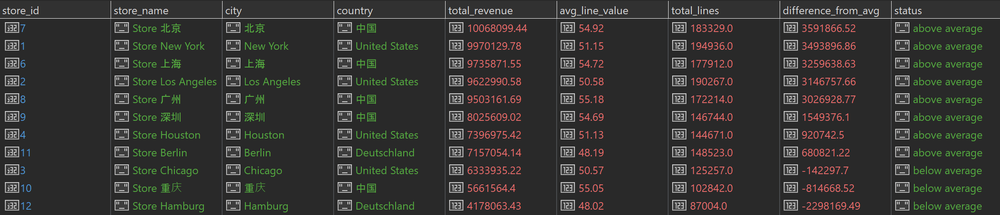
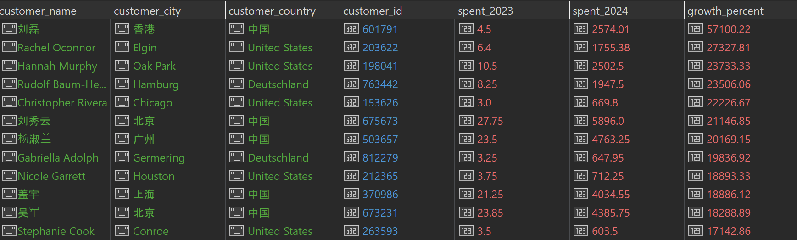
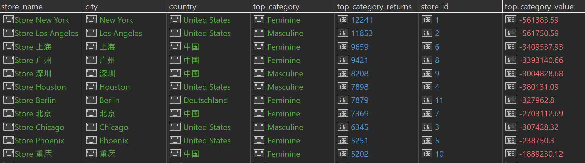
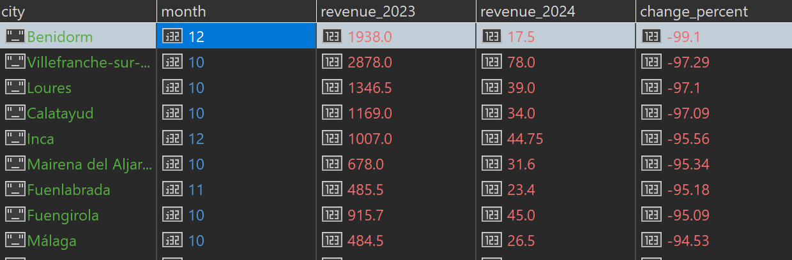

# Optimizovani upiti - Menadzer prodaje

### Upit 1: Koje prodavnice su ostvarile najveći prihod u 2024. godini i koliko odstupaju od proseka prodavnica koje su te godine imale prodaju?

```javascript
db.invoice_lines_menadzer.aggregate([
  { $match: { transaction_type: "Sale", year: 2024 } },

  {
    $group: {
      _id: "$store_id",
      store_name: { $first: "$store_name" },
      city: { $first: "$store_city" },
      country: { $first: "$store_country" },
      total_revenue: { $sum: "$line_total_usd" },
      avg_line_value: { $avg: "$line_total_usd" },
      total_lines: { $sum: 1 }
    }
  },

  { $sort: { total_revenue: -1 } },
  {
    $group: {
      _id: null,
      stores: { $push: "$$ROOT" },
      global_avg: { $avg: "$total_revenue" }
    }
  },
  { $unwind: "$stores" },
  {
    $project: {
      _id: 0,
      store_id: "$stores._id",
      store_name: "$stores.store_name",
      city: "$stores.city",
      country: "$stores.country",
      total_revenue: { $round: ["$stores.total_revenue", 2] },
      avg_line_value: { $round: ["$stores.avg_line_value", 2] },
      total_lines: "$stores.total_lines",
      difference_from_avg: {
        $round: [{ $subtract: ["$stores.total_revenue", "$global_avg"] }, 2]
      },
      status: {
        $cond: {
          if: { $gte: ["$stores.total_revenue", "$global_avg"] },
          then: "above average",
          else: "below average"
        }
      }
    }
  },
  { $sort: { total_revenue: -1 } }
])
```

**Rezultat upita:**


*Prosecno vreme izvrsavanja: 4.66s*  

### Upit 2: Kojih 20 kupaca je u 2024. godini imali najveći rast potrošnje u odnosu na 2023?

```javascript
db.invoice_lines_menadzer.aggregate([
  {
    $match: {
      transaction_type: "Sale",
      year: { $in: [2023, 2024] }
    }
  },
  {
    $group: {
      _id: {
        customer_id: "$customer_id",
        year: "$year"
      },
      customer_name: { $first: "$customer_name" },
      customer_city: { $first: "$customer_city" },
      customer_country: { $first: "$customer_country" },
      total_spent: { $sum: "$line_total" }
    }
  },
  {
    $group: {
      _id: "$_id.customer_id",
      customer_name: { $first: "$customer_name" },
      customer_city: { $first: "$customer_city" },
      customer_country: { $first: "$customer_country" },
      yearly_data: {
        $push: { year: "$_id.year", total_spent: "$total_spent" }
      }
    }
  },
  {
    $project: {
      customer_name: 1,
      customer_city: 1,
      customer_country: 1,
      spent_2023: {
        $sum: {
          $map: {
            input: { $filter: { input: "$yearly_data", as: "d", cond: { $eq: ["$$d.year", 2023] } } },
            as: "d", in: "$$d.total_spent"
          }
        }
      },
      spent_2024: {
        $sum: {
          $map: {
            input: { $filter: { input: "$yearly_data", as: "d", cond: { $eq: ["$$d.year", 2024] } } },
            as: "d", in: "$$d.total_spent"
          }
        }
      }
    }
  },
  { $match: { spent_2023: { $gt: 0 }, spent_2024: { $gt: 0 } } },
  {
    $project: {
      _id: 0,
      customer_id: "$_id",
      customer_name: 1,
      customer_city: 1,
      customer_country: 1,
      spent_2023: { $round: ["$spent_2023", 2] },
      spent_2024: { $round: ["$spent_2024", 2] },
      growth_percent: {
        $round: [
          {
            $multiply: [
              { $divide: [{ $subtract: ["$spent_2024", "$spent_2023"] }, "$spent_2023"] },
              100
            ]
          }, 2
        ]
      }
    }
  },
  { $match: { growth_percent: { $gt: 0 } } },
  { $sort: { growth_percent: -1 } },
  { $limit: 20 }
])
```

**Rezultat upita:**


*Prosecno vreme izvrsavanja: 34.10s*  

### Upit 3: Identifikovati koje prodavnice imaju najvise problema sa vracanjem robe i koja kategorija dominira u povracajima.

```javascript
db.invoice_lines_menadzer.aggregate([
  { $match: { transaction_type: "Return" } },
  {
    $group: {
      _id: { store_id: "$store_id", category: "$category" },
      store_name: { $first: "$store_name" },
      city: { $first: "$store_city" },
      country: { $first: "$store_country" },
      total_returns: { $sum: "$quantity" },
      total_return_value: { $sum: "$line_total" }
    }
  },

  { $sort: { "_id.store_id": 1, total_returns: -1 } },

  {
    $group: {
      _id: "$_id.store_id",
      store_name: { $first: "$store_name" },
      city: { $first: "$city" },
      country: { $first: "$country" },
      top_category: { $first: "$_id.category" },
      top_category_returns: { $first: "$total_returns" },
      top_category_value: { $first: "$total_return_value" }
    }
  },
  {
    $project: {
      _id: 0,
      store_id: "$_id",
      store_name: 1,
      city: 1,
      country: 1,
      top_category: 1,
      top_category_returns: 1,
      top_category_value: { $round: ["$top_category_value", 2] }
    }
  },

  { $sort: { top_category_returns: -1 } }
])
```

**Rezultat upita:**
 

*Prosecno vreme izvrsavanja: 0.72s*  

### Upit 4: Prikazati koji gradovi pokazuju pad prihoda u Q4 (oktobar, novembar, decembar) u 2024. godini u odnosu na isti period 2023.

```javascript
db.invoice_lines_menadzer.aggregate([
  {
    $match: {
      transaction_type: "Sale",
      month: { $in: [10, 11, 12] },
      year: { $in: [2023, 2024] }
    }
  },
  {
    $group: {
      _id: {
        city: "$customer_city",
        year: "$year",
        month: "$month"
      },
      monthly_revenue: { $sum: "$line_total" }
    }
  },
  {
    $group: {
      _id: { city: "$_id.city", month: "$_id.month" },
      yearly_data: { $push: { year: "$_id.year", revenue: "$monthly_revenue" } }
    }
  },
  {
    $project: {
      _id: 0,
      city: "$_id.city",
      month: "$_id.month",
      revenue_2023: {
        $sum: { $map: { input: { $filter: { input: "$yearly_data", as: "d", cond: { $eq: ["$$d.year", 2023] } } }, as: "d", in: "$$d.revenue" } }
      },
      revenue_2024: {
        $sum: { $map: { input: { $filter: { input: "$yearly_data", as: "d", cond: { $eq: ["$$d.year", 2024] } } }, as: "d", in: "$$d.revenue" } }
      }
    }
  },
  { $match: { revenue_2023: { $gt: 0 }, revenue_2024: { $gt: 0 } } },
  {
    $project: {
      city: 1,
      month: 1,
      revenue_2023: { $round: ["$revenue_2023", 2] },
      revenue_2024: { $round: ["$revenue_2024", 2] },
      change_percent: {
        $round: [
          { $multiply: [{ $divide: [{ $subtract: ["$revenue_2024", "$revenue_2023"] }, "$revenue_2023"] }, 100] },
          2
        ]
      }
    }
  },
  { $match: { change_percent: { $lt: 0 } } },
  { $sort: { change_percent: 1 } }
])
```

**Rezultat upita:**
 

*Prosecno vreme izvrsavanja: 2.05s*  


### Upit 5: Koji su top 10 radnika po prihodu u decembru?

```javascript
db.invoice_lines_menadzer.aggregate([
  {
    $match: {
      transaction_type: "Sale",
      month: 12
    }
  },
  {
    $group: {
      _id: "$employee_id",
      store_id: { $first: "$store_id" },
      store_name: { $first: "$store_name" },
      city: { $first: "$store_city" },
      country: { $first: "$store_country" },
      total_revenue: { $sum: "$line_total" },
      invoice_ids: { $addToSet: "$invoice_id" }
    }
  },
  {
    $project: {
      _id: 0,
      employee_id: "$_id",
      store_id: 1,
      store_name: 1,
      city: 1,
      country: 1,
      total_revenue: { $round: ["$total_revenue", 2] },
      total_invoices: { $size: "$invoice_ids" }
    }
  },

  { $sort: { total_revenue: -1 } },
  { $limit: 10 }
])
```

**Rezultat upita:**
 

*Prosecno vreme izvrsavanja: 2.45s*  
